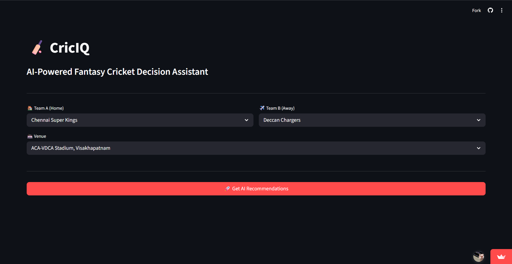
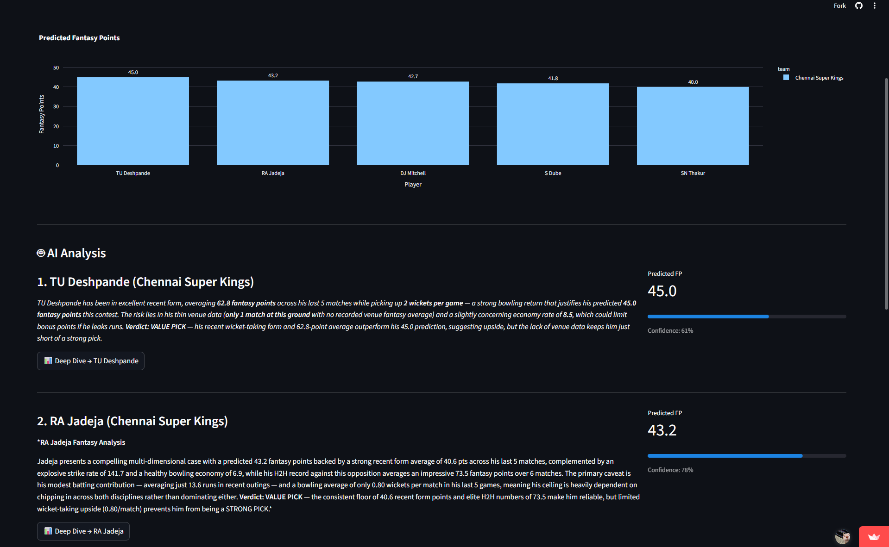
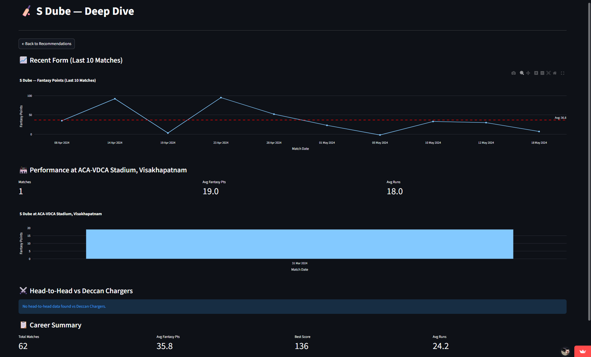
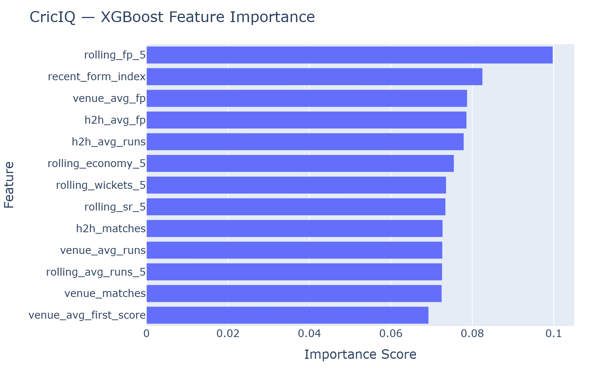

# 🏏 CricIQ — AI-Powered Fantasy Cricket Decision Assistant

> **Pick smarter. Win bigger.** CricIQ uses machine learning and AI to predict IPL fantasy points and explain *why* each player is worth picking — backed by real data, not gut feeling.

🔗 **[Live App →](https://criciq-fantasy.streamlit.app)**

---



## What It Does

CricIQ is a full-stack data science application that helps Dream11 fantasy cricket players make data-driven decisions. Select an upcoming IPL match, and CricIQ will:

1. **Predict fantasy points** for every player using an XGBoost model trained on 260,000+ IPL deliveries (2008–2024)
2. **Generate AI-powered analysis** via Claude API — 3-sentence recommendations that cite real stats, not generic advice
3. **Show deep-dive analytics** — venue performance, recent form charts, and head-to-head records

---

## Screenshots

### AI Recommendations — Top 5 Picks with Explanations


### Player Deep Dive — Form, Venue Stats & H2H


### Feature Importance — What the Model Learned


---

## Tech Stack

| Layer | Technology |
|-------|-----------|
| ML Model | XGBoost (regression) |
| AI Layer | Anthropic Claude API (claude-sonnet-4-6) |
| Web App | Streamlit |
| Data Viz | Plotly |
| Data | Kaggle IPL Dataset (2008–2024), 260,920 deliveries |
| Deployment | Streamlit Cloud |

---

## How It Works

### 1. Data Pipeline (`src/ingest.py`)
- Loads ball-by-ball IPL data (2008–2024)
- Cleans and standardizes team/venue names across 17 seasons
- Merges match-level metadata with delivery data

### 2. Fantasy Points Engine (`src/features.py`)
- Calculates Dream11 fantasy points from raw ball-by-ball data
- Implements the full Dream11 scoring system: runs, boundaries, milestones, wickets, maidens, catches, stumpings, run-outs
- Engineers 13 predictive features per player per match:
  - **Rolling form**: avg runs, strike rate, wickets, economy (last 5 matches)
  - **Venue history**: avg fantasy points and runs at specific grounds
  - **Head-to-head**: performance against today's opposition
  - **Match context**: venue avg first innings score
- All features use only past data (no leakage) via `shift(1)` + expanding windows

### 3. ML Model (`src/model.py`)
- XGBoost regressor trained on 22,354 player-match rows (2008–2023)
- Tested on 1,677 rows from the 2024 season
- Beats the baseline (predict-mean) on MAE
- Top features: `rolling_fp_5`, `recent_form_index`, `venue_avg_fp`

### 4. AI Analysis (`src/agent.py`)
- After ML predictions, Claude API generates a 3-sentence recommendation per player
- Each recommendation cites specific numbers from the player's stats
- Sentences cover: data case, risk/caveat, and final verdict (Strong Pick / Value Pick / Risky Pick / Avoid)
- Parallel API calls (ThreadPoolExecutor) for 3–4x faster response

### 5. Web App (`src/app.py`)
- **Screen 1**: Select match (Team A vs Team B) and venue
- **Screen 2**: Top 5 predicted players with bar chart, AI analysis, and confidence scores
- **Screen 3**: Player deep dive — recent form line chart, venue performance, head-to-head stats, career summary

---

## Project Structure

```
criciq/
├── data/
│   ├── raw/              # IPL ball-by-ball + match CSVs (gitignored)
│   └── processed/        # Cleaned feature matrix
├── models/
│   └── xgb_fantasy.joblib  # Trained XGBoost model
├── src/
│   ├── ingest.py          # Data loading + cleaning
│   ├── features.py        # Fantasy points + feature engineering
│   ├── model.py           # XGBoost training + evaluation
│   ├── agent.py           # Claude API integration
│   └── app.py             # Streamlit web app
├── assets/                # Screenshots + charts
├── README.md
└── requirements.txt
```

---

## Run Locally

```bash
# Clone
git clone https://github.com/errorboy404/criciq.git
cd criciq

# Setup
python -m venv venv
source venv/bin/activate  # Windows: venv\Scripts\activate
pip install -r requirements.txt

# Set API key
export ANTHROPIC_API_KEY="your-key-here"  # Windows: $env:ANTHROPIC_API_KEY="your-key-here"

# Run
streamlit run src/app.py
```

---

## Dream11 Scoring System Used

| Action | Points |
|--------|--------|
| Run scored | +1 |
| Boundary (4) | +1 bonus |
| Six | +2 bonus |
| 30 runs | +4 bonus |
| Half century | +8 bonus |
| Century | +16 bonus |
| Duck (dismissed for 0) | -2 |
| Wicket (excl. run out) | +25 |
| LBW / Bowled bonus | +8 |
| 2-wicket haul | +4 bonus |
| 3-wicket haul | +8 bonus |
| 4-wicket haul | +16 bonus |
| 5-wicket haul | +25 bonus |
| Maiden over | +12 |
| Catch | +8 |
| Stumping | +12 |
| Run out | +12 |

---

## Model Performance

| Metric | Value |
|--------|-------|
| Train MAE | 22.14 |
| Test MAE | 26.43 |
| Baseline MAE (predict mean) | 26.53 |
| Test RMSE | 34.17 |
| Train/Test Split | 2008–2023 / 2024 |

> Cricket is inherently unpredictable — a player averaging 40 fantasy points can score 200 on any given day. The model's value is in **ranking players correctly**, not predicting exact scores.

---

## Future Improvements

- Add live squad data via web scraping for upcoming matches
- Incorporate pitch reports and weather conditions
- Add player role detection (batsman/bowler/all-rounder) for role-based recommendations
- Build a captain/vice-captain suggestion engine
- Add pace vs spin bowling split features

---

## Author

**Kaushik Gaur** — [GitHub](https://github.com/errorboy404)

Built in 7 days as a data science portfolio project.

---

## License

MIT
